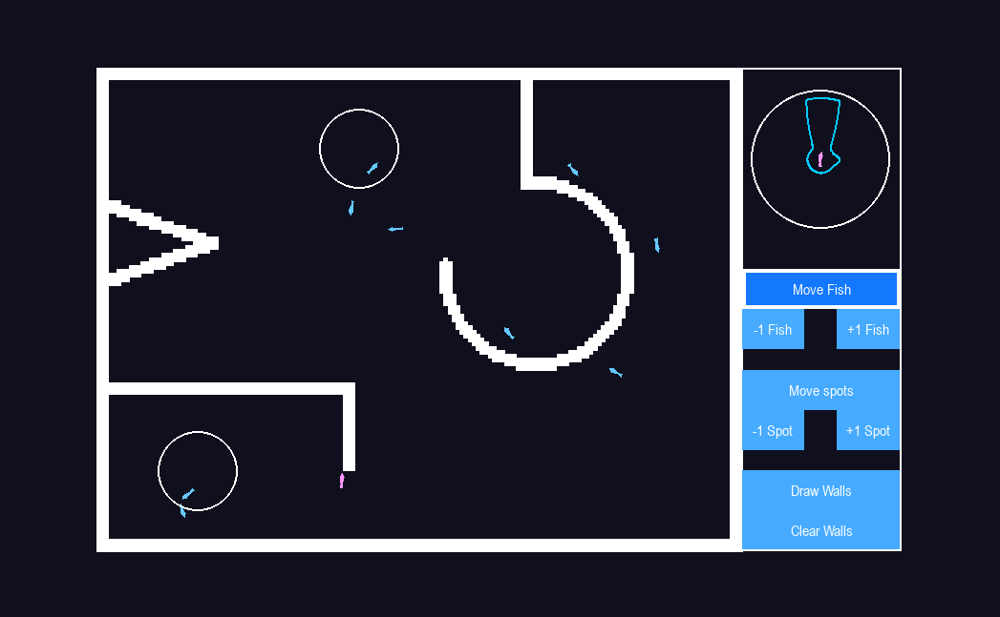
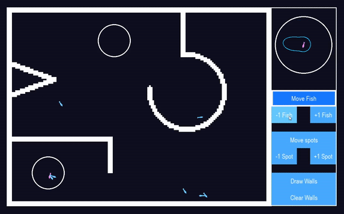
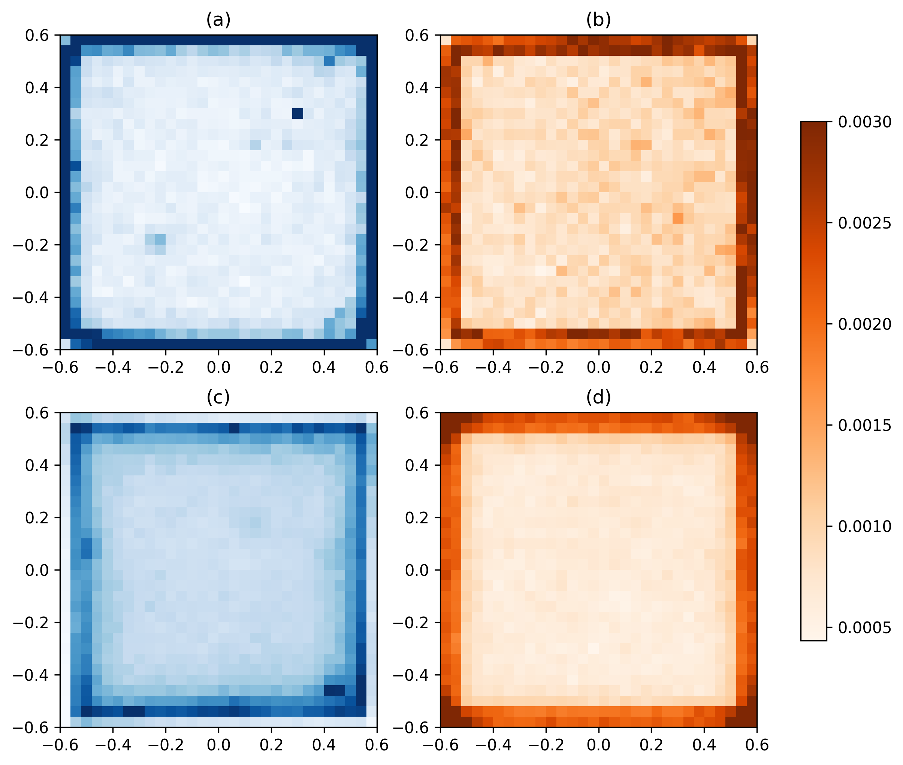
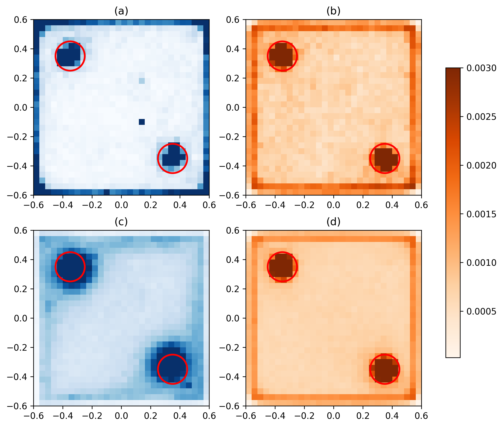
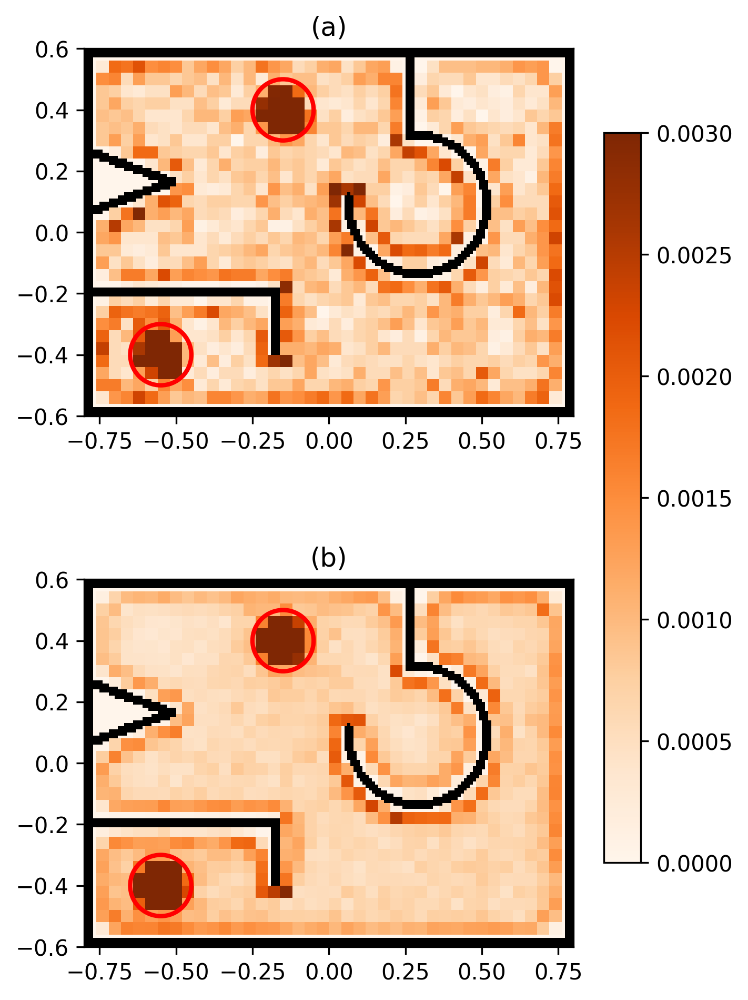

# Collective behaviour 2025/26 project of group F - Model inspired by zebrafish collective behaviour

## Members of group F
- Anja Abramovič | [aanja123](https://github.com/aanja123)
- Ožbej Kresal | [ozbej-k](https://github.com/ozbej-k)
- Matej Rupnik | [mr6231](https://github.com/mr6231)
- Urban Vesel | [ultraviolet99](https://github.com/ultraviolet99)

## Project description
The study used as the starting point for this assignment was [Collignon et al. 2016](#collignon2016). The paper presents a model describing the visual sensory system of zebrafish, introduces a stochastic process based on a probability distribution function to model fish movement depending on their surroundings. The model is then compared to experimental data acquired by recording real life zebrafish and their changes in behaviour when introducing spots of interest into the environment. Our goal is to implement the model, validate it by comparing it to the real life experimental data, and then extend it by adding interactive control over fish and of spots of interest and differently shaped environments to see how the fish react.

## Project plan
### [Milestone: First report - 16. 11. 2025](https://github.com/ozbej-k/Skupinsko-Vedenje-25-26-GroupF/milestone/1):
- Explore existing vision based models and models which explore spots of interest
- Set a strategy for reproducing the results in the source paper
- Discuss and plan implementation (select tools and collect any needed data)

### [Milestone: Second report - 7. 12. 2025](https://github.com/ozbej-k/Skupinsko-Vedenje-25-26-GroupF/milestone/2):
- Include improvements from feedback on the previous report
- Fully implement previously discussed implementation
- Describe our implementation in detail (methods used, possible extensions and deviations from original)
- Describe how we will test and compare our implementation with the original

### [Milestone: Third report - 11. 1. 2026](https://github.com/ozbej-k/Skupinsko-Vedenje-25-26-GroupF/milestone/3):
- Include improvements from feedback on the previous report
- Show our results when compared to existing research
- Provide some ideas for future work, improvements and applications of our final model
- Prepare presentation about our work

## Implementation
The implementation of the stochastic vision-based model described in the the source paper can be found in `code/simulation`. The model has been extended to run in real-time with a running visualisation of the fish in the environment. 

The model supports bounded homogeneous and heterogeneous environments with spots of interest, where fish percieve their surroundings and gather information based on a 270° field of view and give each perceived stimuli a weight depending on how large they appear on in their field of view.

A screenshot of the simulation running in a heterogeneous environment with 10 fish and 2 spots of interest can be seen on the following image.

The model defines an orientation and speed probability density function (PDF) which fish sample at every time step. The speed PDF is built empirically from real life recordings of zebrafish. The orientation PDF is a composite of [von Mises](https://en.wikipedia.org/wiki/Von_Mises_distribution) distributions which define the probability of the fish choosing any direction.

The full orientation PDF $f$ is a composite of the following distributions:
- $f_0$ - basic-swimming or wall-following behaviour if close to wall,
- $f_f$ - influence of other perceived fish,
- $f_s$ - influence of perceived spots of interest.

An example of an orientation PDF can be seen on the following image which contains plots of the PDF in cartesian (left) and polar (right) coordinates, where how different stimuli influence the probability of the fish changing its orientation.

The table below summarizes the parameter configurations tested across experiments which yielded the best outcomes. The parameters alpha and beta weight the influence of social interactions (other fish) and environmental cues (spots of interest), respectively, in the composite orientation probability density function.

| Parameter     | Value | Description                                                                     |
| ------------- | ----- | ------------------------------------------------------------------------------- |
| $\kappa_0$    | 6.3   | Basic-swimming dispersion                                                       |
| $\kappa_w$    | 20    | Wall-following dispersion                                                       |
| $\kappa_f$    | 20    | Perceived fish dispersion                                                       |
| $\kappa_s^0$  | 10    | Spot of interest dispersion (outside spot)                                      |
| $\kappa_s^s$  | 0.5   | Spot of interest dispersion (under spot)                                        |
| $\kappa_{WB}$ | 3     | Forward-facing amplification parameter                                          |
| $\alpha_0$    | 7     | Weight of perceived fish during basic-swimming when only fish are present       |
| $\alpha_w$    | 2     | Weight of perceived fish during wall-following when only fish are present       |
| $\beta_0$     | 0.25  | Weight of perceived spots during basic-swimming when only spots are present     |
| $\beta_w$     | 0.125 | Weight of perceived spots during wall-following when only spots are present     |
| $\alpha_0^B$  | 9     | Weight of perceived fish during basic-swimming when fish and spots are present  |
| $\alpha_w^B$  | 2     | Weight of perceived fish during wall-following when fish and spots are present  |
| $\beta_0^B$   | 0.25  | Weight of perceived spots during basic-swimming when fish and spots are present |
| $\beta_w^B$   | 0.125 | Weight of perceived spots during wall-following when fish and spots are present |

## Interactive simulation

The interactive simulation is located in the `code/simulation` directory.

Running the `sim.py` script will start the simulation, which contains 10 fish and two spots of interest in the bottom left and top right corners.

The interactive simulation supports the following features:
- Add fish by clicking the `+1 Fish` button,
- remove fish by clicking the `-1 Fish` button,
- add spot by clicking the `+1 Spot` button,
- remove spot by clicking the `-1 Spot` button,
- move fish by dragging and dropping them, enabled by toggling the `Move Fish` button, or pressing the `F` key on the keyboard,
- the last clicked / dragged fish will be selected and its orientation PDF will be shown in the circle located at the top right corner as a polar graph, to deselect a fish click anywhere inside the tank while having the `Move Fish` button enabled,
- move spots by dragging and dropping them, enabled by toggling the `Move Spots` button, or pressing the `S` key on the keyboard,
- draw walls by clicking and dragging inside the tank, enabled by toggling the `Draw Walls button`, or pressing the `D` key on the keyboard,
- clear drawn walls by clicking the `Clear Walls` button or pressing the `C` key on the keyboard,
- save drawn walls to `current_tank.png` by pressing the `I` key on the keyboard (to load the drawn tank rename the file to `tank.png`).

## Results
We ran 10 hour long simulations for 4 different environments, which we then compared to real life recorded data of real fish (can be found in `source_paper/Zebrafish_Positions_data`):
- Homogeneous environment with 1 fish
- Homogeneous environment with 10 fish
- Heterogeneous environment with 1 fish and 2 spots
- Heterogeneous environment with 10 fish and 2 spots

The following image contains presence probabilities for a homogeneous environment with 1 fish (top two images) and 10 fish (bottom). The experimental data presence probability can be seen in orange and our simulated presence probability in blue.

The following image contains presence probabilities for a heterogeneous environment with 1 fish (top two images) and 10 fish (bottom). The heterogeneous environment contains two spots of interest marked with red circles. The experimental data presence probability can be seen in orange and our simulated presence probability in blue.

To illustrate fish behaviour in an irregular environment, we ran the following 1-hour simulations:
- Irregular environment with $1$ fish and $2$ spots,
- Irregular environment with $10$ fish and $2$ spots,
whose results can be seen in the image below:

## Conclusion
We successfully implemented the stochastic zebrafish behaviour model presented by Collignon et al. and reproduced presence probabilities for both homogeneous and heterogeneous environments, which closely match experimentally recorded data. We also developed an interactive simulation that allows control over fish and spots, and improved its performance by approximating the solid-angle calculations in the perception model using fitted functions.  
The model was further extended to irregular environments, which can contain arbitrary wall configurations drawn directly within the interactive simulation. The resulting presence probability images, shown on Figure~\ref{drawn_presence}, clearly display fish navigating around the irregular wall structures.  

Future work would focus on adding more stimuli to the environment, such as food and acquiring experimental zebrafish data in irregular environments to evaluate how well the model reproduces real fish behaviour in non square-walled environments.

## References

[1] <a href="https://royalsocietypublishing.org/doi/10.1098/rsos.150473">
Collignon, et al. 2016. *A stochastic vision-based model inspired by zebrafish collective behaviour in heterogeneous environments.*
</a>

