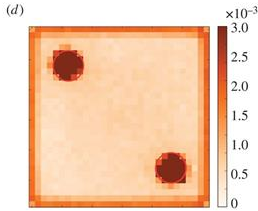

# Collective behaviour 2025/26 project of group F - Model inspired by zebrafish collective behaviour

## Members of group F
- Anja Abramovič | [aanja123](https://github.com/aanja123)
- Ožbej Kresal | [ozbej-k](https://github.com/ozbej-k)
- Matej Rupnik | [mr6231](https://github.com/mr6231)
- Urban Vesel | [ultraviolet99](https://github.com/ultraviolet99)

## Project description
The study used as the starting point for this assignment was [Collignon et al. 2016](#collignon2016). The paper presents a model describing the visual sensory system of zebrafish, introduces a stochastic process based on a probability distribution function to model fish movement depending on their surroundings. The model is then compared to experimental data acquired by recording real life zebrafish and their changes in behaviour when introducing points of interest into the environment. Our goal is to implement the model, validate it by comparing it to the real life experimental data, and then possibly extend it by adding interactive control over positions of points of interest and differently shaped environments to see how the fish react.

## Project plan
### [Milestone: First report - 16. 11. 2025](https://github.com/ozbej-k/Skupinsko-Vedenje-25-26-GroupF/milestone/1):
- Explore existing vision based models and models which explore points of interest
- Set a strategy for reproducing the results in the source paper
- Discuss and plan implementation (select tools and collect any needed data)

### [Milestone: Second report - 7. 12. 2025](https://github.com/ozbej-k/Skupinsko-Vedenje-25-26-GroupF/milestone/2):
- Include improvements from feedback on the previous report
- Fully implement previously discussed implementation
- Describe our implementation in detail (methods used, possible extensions and deviations from original)
- Describe how we will test and compare our implementation with the original

### [Milestone: Third report - 11. 1. 2026](https://github.com/ozbej-k/Skupinsko-Vedenje-25-26-GroupF/milestone/3):
- Include improvements from feedback on the previous report
- Show our results when compared to existing research
- Provide some ideas for future work, improvements and applications of our final model
- Prepare presentation about our work

## Implementation

### Visualization
- Implemented basic 2D fish movement animation
- Added fish tank occupancy heatmap

### Zebrafish perception model
- Implemented Fish, Spot, and Tank classes, as well as geometry-calculation helper functions.
- Added fish field of vision and implemented solid-angle calculations for fish and spots (discs).
- Implemented wall detection and escape-direction calculation.
- Perception data output now includes ATf and ATs (total solid angle of fish and spots). For each detected fish and spot: ID, solid angle, and direction are provided. Wall distance from the focal fish is included, along with a near_wall indicator and escape directions when near_wall = True.

## Results

We used our current model to simulate the movements of zebrafish in a tank, like the one used in Collignon et al. 2016. We created an occupancy heat map, which we then compared to the occupancy heat map created from the measured fish movement data, provided by the authors of the paper.

As we can see in Figure 1 (Simulation) and Figure 2 (Measured Data), our model simulations are fairly accurate. In Figure 3 (Original Paper Simulation) are the results of the original paper's simulation, presented in a heat map.

 

 
     
<b>Figure 1:</b> Occupancy heat map – model simulation.
 

    
    
<b>Figure 2:</b> Occupancy heat map – measured data.

    
    
<b>Figure 3:</b> Occupancy heat map – original paper model simulation. Image from Collignon et al. 2016.

## References

[1] <a href="https://royalsocietypublishing.org/doi/10.1098/rsos.150473">
Collignon, et al. 2016. *A stochastic vision-based model inspired by zebrafish collective behaviour in heterogeneous environments.*
</a>
